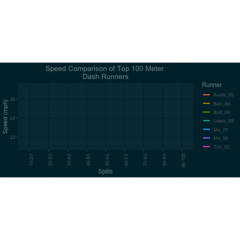

```{r setup, include=FALSE}
knitr::opts_chunk$set(echo = TRUE)
```

```{r include=FALSE}
library(tidyverse)
library(patchwork)
library(janitor)
library(easystats)
library(modelr)
library(broom)
library(ggplot2)
library(plotly)
library(magick)
library(ggthemes)
library(gganimate)
library(e1071)
library(caret)
library(rpart)
library(rpart.plot)


# Load in the 100m splits data set
data100m <- read_csv(file = "Olympic100mSplits.csv")

# Load in the bigger 100m splits data set
olympic100 <- read.csv("Olympic100mNewData.csv")

# Tidy the data100m  data set, call it "df100m"
df100m <- 
  pivot_longer(data100m, 2:8, names_to = "runner", values_to = "times")

colnames(df100m)[1] = "splits"

df100m$splits<-gsub("m","",as.character(df100m$splits))

# Tidy the bigger data100m data set, call in "olympic100m"
olympic100 <- t(olympic100) %>% as.data.frame()
colnames(olympic100) <- olympic100[1,]
olympic100$athlete <- rownames(olympic100)

olympic100 <- olympic100[2:20,c(16, 1:15)]


# Converting columns to numeric
olympic100[2:16] <- lapply(olympic100[2:16], FUN = as.numeric)


# Add speed 
df100m$speed <- 22.3694/df100m$times

# Flip the data100m data set, call it "flip100m"
names100<-c("RT", "Start-10m", "10-20m", "20-30m", "30-40m", "40-50m", "50-60m", "60-70m", "70-80m", "80-90m", "90-100m", "TOTAL")

flip100m <- setNames(data.frame(t(data100m[,-1])), data100m[,1])

colnames(flip100m) <- names100

# Load in the 400m splits data set
data400m <- read_csv(file = "Olympic400mSplits.csv")

# Tidy the data400m data set, call it "df400m"
df400m <- 
  pivot_longer(data400m, 2:9, names_to = "runner", values_to = "times")

colnames(df400m)[1] = "splits"

#Flip the data400m data set, call it "flip400m"
names400 <- c("Start-100m", "100-150m", "150-200m", "200-250m", "250-300m", "300-350m", "350-400m", "1st200m", "2nd200m", "Differential", "TOTAL")

flip400m <- setNames(data.frame(t(data400m[,-1])), data400m[,1])

colnames(flip400m) <- names400

plot300350m <- df400m %>% 
  filter(splits == "TOTAL" | splits == "300-350") %>% 
  pivot_wider(names_from = splits, values_from = times)

colnames(plot300350m)[2] <- "split"

DT <- rpart(control=rpart.control(minsplit=1, minbucket=1, cp=0.001),
            TOTAL ~ . -athlete, 
            data = olympic100, 
            method="anova")

```

### [ Introduction and Background]{style="color:white"}

```{=html}
<style>
    body { background-color: DarkSlateGrey; }
</style>
```
[I became interested in the human body's ability to sprint over certain distances after learning that in the 100m dash, the shortest of the Olympic Track and Field events, the sprinters are already slowing down towards the end. This was intriguing to me, and I wanted to learn more.]{style="color:white"}

[To begin this project, I took data from <https://speedendurance.com/> which has data from many events in track and field, including the splits for each runner in different events. In track and field, a "split" is a term used to define a runner's pace over different lengths of the race; how fast they complete a certain section of the race.]{style="color:white"}

# [ 100 meter dash]{style="color:white"}

[Plotted below are some of the fastest 100 meter dashes in Olympic history, with a wide range of years, from Carl Lewis in 1988 to Usain Bolt in 2008. The 0-10m split is not shown, as that is largely a factor of the runner's reaction time.]{style="color:white"}

```{r, echo = FALSE,fig.align='center', out.width="700px"}

```

[We can see from the plot above that runners indeed slow down nearing the end of the race, and in some cases, like Bolt and Mo, they slow down *quite a lot*. ]{style="color:white"}

### [Correlation tests ]{style="color:white"}

[The cor.test function tests for association between paired samples, using one of Pearson's product moment correlation coefficient. A p-value less than 0.05 is typically considered to be statistically significant, meaning that the two events are strongly correlated.]{style="color:white"}

```{r eval=FALSE, fig.align='center', include=TRUE, out.width="700px"}
cor.test(olympic100m$TOTAL, olympic100m$RT)
cor.test(olympic100m$TOTAL, olympic100m$`Start-10m`)
cor.test(olympic100m$TOTAL, olympic100m$`10-20m`)
cor.test(olympic100m$TOTAL, olympic100m$`20-30m`)
cor.test(olympic100m$TOTAL, olympic100m$`30-40m`)
cor.test(olympic100m$TOTAL, olympic100m$`40-50m`)
cor.test(olympic100m$TOTAL, olympic100m$`50-60m`)
cor.test(olympic100m$TOTAL, olympic100m$`60-70m`)
cor.test(olympic100m$TOTAL, olympic100m$`70-80m`)
cor.test(olympic100m$TOTAL, olympic100m$`80-90m`)
cor.test(olympic100m$TOTAL, olympic100m$`90-100m`)
cor.test(olympic100m$TOTAL, olympic100m$`Age`)
cor.test(olympic100m$TOTAL, olympic100m$`height(cm)`)
cor.test(olympic100m$TOTAL, olympic100m$`weight(lb)`)

```

[ After testing the correlation between the final time and the different splits, we see that the 50-60m split has the lowest p-value, or the greatest significance.]{style="color:white"}

```{r, echo = FALSE,fig.align='center', out.width="700px"}

```

[ We'll see the significance of the 50-60m split in the 100m dash more as we explore further down.]{style="color:white"}

# [400 meter dash]{style="color:white"}

[Let's look at splits from the 400 meter dash. This is a much longer event in track and field, so let's see if we can observe anything that stands out]{style="color:white"}

[Plotted below are the 50m splits from the 2008 Olympic Trials Men's 400m Finals]{style="color:white"}

```{r, echo = FALSE,fig.align='center',out.width = "700px"}

```

### [Wow!]{style="color:white"}

[This is much more bizarre than the 100m dash, we see that the runners start out very fast, then slow down, speed up again, then gradually slow down.]{style="color:white"}

[Running the same correlation test on the different splits of the 400m dash, we see that the 300-350m split, the penultimate 50m, has the strongest correlation to the final time.]{style="color:white"}

```{r, echo = FALSE,fig.align='center', out.width="700px"}
knitr::include_graphics("Cortest400m.png")
```

[Now that we have found the most significant split from each race, the 50-60m split from the 100m dash and the 300-350m split from the 400m dash, let's see if we can use our naked human eyes to see if we notice anything peculiar ]{style="color:white"}

# [Speed!]{style="color:white"}

[Since the data we are analyzing includes distance and time, we can use math to extrapolate the runner's *speed*. Let's animate the runner's speed for the 100m dash in real time.]{style="color:white"}

## [100m dash animated]{style="color:white"}

```{r, echo = FALSE, fig.align='center',out.width="90%"}


```

## [400m dash animated]{style="color:white"}

```{r, echo = FALSE, fig.align='center',out.width="90%"}


```

[ Just from looking at the animations, we get some idea of why those two splits are so important. For the 400m dash, I've included an interactive plot to clearly see the significance of the 300-350m dash.]{style="color:white"}

### [Interactive Plot (400m)]{style="color:white"}

```{r, echo = FALSE, fig.align='center',out.width = "700px",}
interactive300350 <- ggplot(plot300350m, aes(x = TOTAL, y = split, col = runner)) + 
  geom_point(size = 4)+
  geom_line() +
  labs(y = "300-350m SPLIT")+
  theme_solarized_2(light=F) +
  theme(axis.title.x=element_text(colour="white")) +
  theme(axis.title.y=element_text(colour="white")) +
  theme(axis.text.x = element_text(color = "white")) +
  theme(axis.text.y = element_text(color = "white")) +
  theme(strip.text = element_text(colour = "white")) +
  theme(legend.text = element_text(color = "white")) +
  theme(legend.title = element_text(color = "white"))

font = list(
  family = "DM Sans",
  size = 15,
  color = "white")

label = list(
  bgcolor = "232F34",
  bordercolor = "transparent",
  font = font)

ggplotly(interactive300350) %>% 
  style(hoverlabel = label) %>% 
  layout(font = font) %>% 
  config(displayModeBar = FALSE)
```

[For the 100m dash, I've made a *regression tree*, which is a learning approach commonly used in statistics, data mining and machine learning. A regression tree functions as a predictive model to draw conclusions about a set of observations.]{style="color:white"}

### [Regression Tree (100m)]{style="color:white"}

```{r, echo = FALSE, fig.align='center',out.width="90%"}
rpart.plot(digits = 4,
           DT)
```

<span style="color:white"> As we can see in the regression tree above, the very first thing this model looks at to determine a quicker or slower final time is the 50-60m split. Interestingly, the reaction time plays a much smaller role than one would expect.
